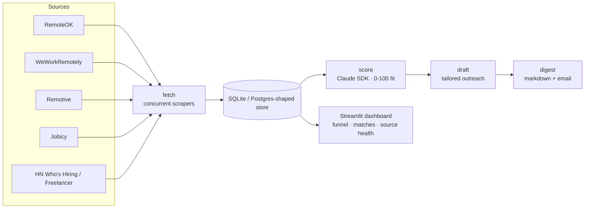

# Home page copy + architecture diagram for bak-dev.com

Paste-ready copy for the bak-dev.com home hero + about section, plus a
Mermaid architecture diagram to replace the placeholder images.

**Source of truth:** every string here is copied from
[`../../positioning.md`](../../positioning.md). If you change a line, change it
there too — do not let the site and the positioning doc drift.

---

## 1. Hero

**H1**
> Hi, I'm Akram — I build AI-powered tools on top of 8 years of production fullstack work.

**H2 / subhead**
> Senior fullstack engineer (PHP/Laravel/Flutter). Now bringing Claude SDK and open-source LLMs to the e-commerce and SMB problems I've been solving for nearly a decade.

**Primary CTA:** `Work with me` → `/hire-me`
**Secondary CTA:** `See the build` → `https://github.com/akrambak/career-os`

---

## 2. About section (lead with the new positioning)

> I'm not an AI engineer pretending to know e-commerce. I'm an e-commerce
> engineer who learned how to build agents.
>
> Eight years shipping production PHP/Laravel, PrestaShop, Vue and Flutter for
> real customers — now layering Claude SDK and self-hosted open-source LLMs on
> top of that foundation. The bet: there's no shortage of engineers who can
> wire up an LLM call. There's a shortage of engineers who've shipped real
> products to real customers *and* can build reliable agentic systems.
>
> Right now I'm building **Career-OS** in public — an AI-agent system that
> crawls opportunities, scores them against my profile with Claude, drafts
> tailored outreach, and manages my online presence end-to-end. Open source
> from commit 1.

**Open to:** FT remote (senior fullstack where AI is in the brief, or agent-systems roles) · Freelance/contract (production-grade AI on existing Laravel/PrestaShop/Vue/Flutter stacks). Bilingual FR/EN.

---

## 3. Architecture diagram (replaces placeholder image)

Career-OS pipeline — render with Mermaid (`@mermaid-js/mermaid` or the
`rehype-mermaid` MDX plugin; GitHub renders it natively in this file):

**Alt text for the ``/figure:** "Career-OS pipeline: multiple job-board
scrapers feed a store, Claude scores each posting for fit, drafts outreach,
and emits a digest and dashboard."

---

## 4. Install notes

- Home copy is framework-agnostic — drop the strings into your existing hero
  and about components.
- If bak-dev.com renders MDX, paste the Mermaid block directly into the blog
  post / home MDX and enable a mermaid plugin. Otherwise export the diagram to
  SVG/PNG once (e.g. via `mermaid.live`) and commit it as `public/architecture.svg`.
- Remove the old `/Modules` and `/Themes` placeholder pages while you're in the
  site repo (Phase 0 item 2) and drop their nav links.
